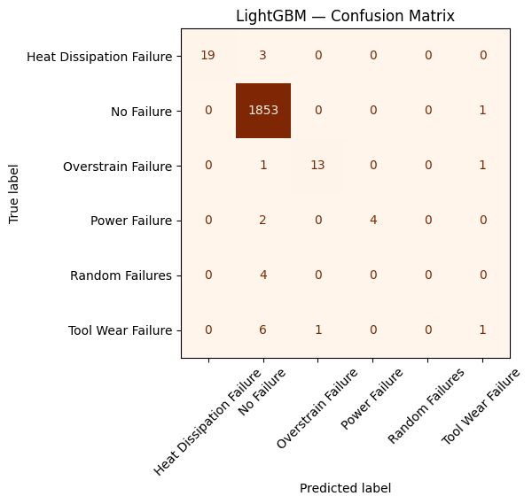
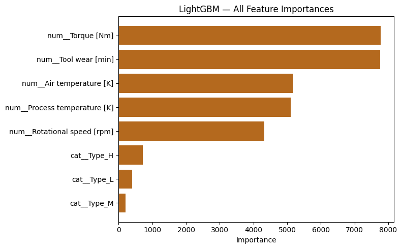
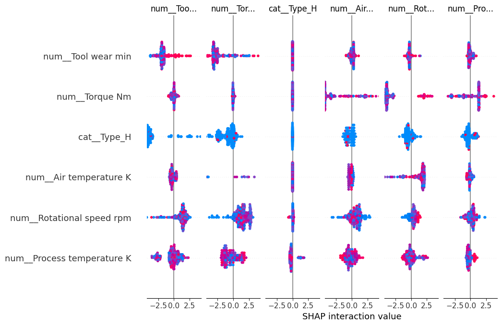

# Scalable Multi-Failure Predictive Maintenance System with Confidence-Based Prioritization and Resilience to Unknown Failures

Machine Learning — Project

A machine learning pipeline that classifies multiple industrial machine failure types
from historical sensor data, with a single reusable scikit-learn preprocessing pipeline
shared across training, tuning, and explainability.

## Problem

Industrial predictive maintenance systems often detect only known failure patterns with
static models and assume sensor data is always reliable. This project builds a classifier
for multiple failure types that stays robust under class imbalance and is structured to
extend toward adaptive learning and unknown-failure handling.

## Dataset

- Source: [Kaggle — Machine Predictive Maintenance Classification](https://www.kaggle.com/datasets/shivamb/machine-predictive-maintenance-classification)
- 10,000 records, 10 raw columns
- Target: `Failure Type` (6 classes, ~97% "No Failure")
- Model inputs: 5 numeric sensor readings + `Type` (one-hot) = 8 features
- A copy is included at [`data/predictive_maintenance.csv`](data/predictive_maintenance.csv)

## Approach

1. **Preprocessing** — missing-value and duplicate checks (none found), IQR outlier removal
   (459 rows dropped → 9,541 remaining), `LabelEncoder` for the target, `OneHotEncoder` for
   `Type`, `StandardScaler` for numeric features — all wrapped in one `ColumnTransformer` /
   `Pipeline`.
2. **Feature ranking** — mutual information (Torque > Rotational speed > Tool wear >
   Air temp > Process temp).
3. **Modeling** — non-ensemble (Logistic Regression, Random Forest, SVM-RBF) and
   ensemble (LightGBM, XGBoost, CatBoost).
4. **Validation & tuning** — 5-fold Stratified K-Fold, `RandomizedSearchCV` with
   weighted-F1 scoring.
5. **Interpretability** — SHAP (TreeExplainer) on the tuned XGBoost model.
6. **Unsupervised cross-check** — K-Means (k=6).

## Results (test set)

**Best model: tuned LightGBM — 99.00% accuracy (0.9900), 0.9878 weighted F1-Score.**

All metrics are weighted averages on the held-out 20% test split (1,909 rows).

### Feature ranking (mutual information)

| Feature | MI score |
|---------|----------|
| Torque [Nm] | 0.0429 |
| Rotational speed [rpm] | 0.0324 |
| Tool wear [min] | 0.0281 |
| Air temperature [K] | 0.0206 |
| Process temperature [K] | 0.0077 |

### Non-ensemble models

| Model | Accuracy | Precision | Recall | F1-Score |
|-------|----------|-----------|--------|----------|
| Logistic Regression | 0.9801 | 0.9728 | 0.9801 | 0.9750 |
| Random Forest | 0.9806 | 0.9747 | 0.9806 | 0.9749 |
| SVM (RBF) | 0.9759 | 0.9666 | 0.9759 | 0.9662 |

Tuned params: LogReg `C=10, penalty=l2` · Random Forest `n_estimators=100, max_depth=15, min_samples_split=5` · SVM `C=10, gamma=scale`.

### Ensemble models — before vs. after tuning

| Model | Stage | Accuracy | Precision | Recall | F1-Score |
|-------|-------|----------|-----------|--------|----------|
| LightGBM | before | 0.9900 | 0.9849 | 0.9900 | 0.9874 |
| **LightGBM** | **after** | **0.9900** | **0.9862** | **0.9900** | **0.9878** |
| XGBoost | before | 0.9874 | 0.9836 | 0.9874 | 0.9853 |
| XGBoost | after | 0.9869 | 0.9811 | 0.9869 | 0.9836 |
| CatBoost | before | 0.9874 | 0.9816 | 0.9874 | 0.9843 |
| CatBoost | after | 0.9874 | 0.9811 | 0.9874 | 0.9840 |

Tuned params: LightGBM `lr=0.05, num_leaves=63, max_depth=8` · XGBoost `lr=0.1, max_depth=6, subsample=0.6` · CatBoost `depth=4, lr=0.05, l2_leaf_reg=1`.
XGBoost's F1 dips slightly after tuning — `RandomizedSearchCV` samples a random subset of the grid and is not guaranteed to beat the default every run.

### Final ranking (weighted F1-Score)

LightGBM > CatBoost > XGBoost > Logistic Regression > Random Forest > SVM (RBF)

### ROC-AUC cross-check (weighted one-vs-rest)

| Model | AUC |
|-------|-----|
| SVM (RBF) | 0.9649 |
| Logistic Regression | 0.9632 |
| LightGBM | 0.9552 |
| CatBoost | 0.9423 |
| Random Forest | 0.9280 |
| XGBoost | 0.9228 |

By AUC, SVM and Logistic Regression lead — an expected effect of the ~97% "No Failure"
imbalance: AUC rewards ranking rare failures above the majority across all thresholds,
while F1 at the default threshold rewards getting the exact class label right. F1 stays
the primary metric because it matches the tuning objective.

### Best model — confusion matrix



### Feature importance (LightGBM)



### Explainability — SHAP (tuned XGBoost)



Mechanical load (Torque) and degradation (Tool wear) dominate; thermal features drive the
heat-dissipation class; product `Type` contributes least.

Confusion matrices, feature-importance bars, and the SHAP bar plot for every model are in
[`images/`](images/).

### Unsupervised cross-check — K-Means (k=6)

Silhouette 0.1862, Adjusted Rand Index 0.0005. Clusters (deterministic given the fixed
`random_state` / `n_init`) mostly group "No Failure"; failure types scatter across clusters.

| Cluster | Heat Dissip. | No Failure | Overstrain | Power | Random | Tool Wear |
|--------:|-------------:|-----------:|-----------:|------:|-------:|----------:|
| 0 | 64 | 1450 | 46 | 13 | 5 | 18 |
| 1 | 45 | 1617 | 0 | 2 | 6 | 0 |
| 2 | 0 | 1489 | 30 | 3 | 4 | 13 |
| 3 | 0 | 1573 | 0 | 0 | 2 | 1 |
| 4 | 2 | 1601 | 0 | 12 | 0 | 0 |
| 5 | 0 | 1535 | 0 | 0 | 1 | 9 |

## Files

| Path | Description |
|------|-------------|
| `predictive_maintenance.ipynb` | Full analysis notebook (rebuilt from a fresh Colab run) |
| `COE305_Final_Project_Report.docx` | Written project report |
| `data/predictive_maintenance.csv` | Dataset |
| `images/` | All 11 plots exported from the notebook (6 confusion matrices, 3 feature-importance bars, 2 SHAP plots) |
| `requirements.txt` | Python dependencies |

## Running

```bash
pip install -r requirements.txt
jupyter notebook predictive_maintenance.ipynb
```

The first notebook cell downloads the dataset via the Kaggle API. To skip that, point the
`pd.read_csv(...)` call at `data/predictive_maintenance.csv` instead.

## Tools

Python, pandas, NumPy, scikit-learn, LightGBM, XGBoost, CatBoost, SHAP, Matplotlib, Seaborn.
